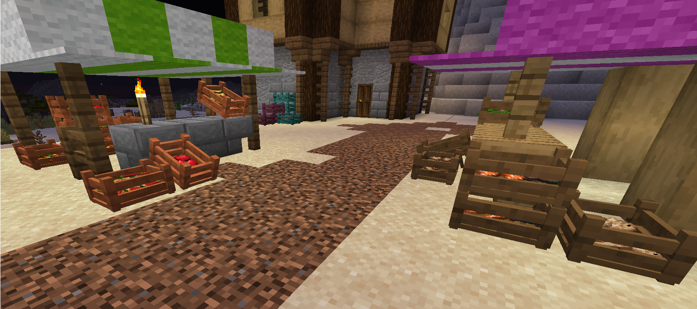
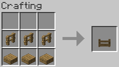
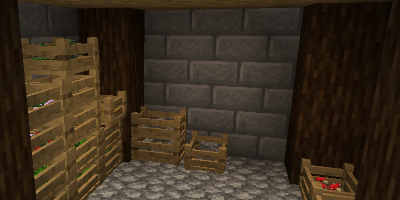
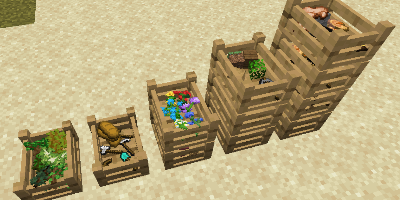
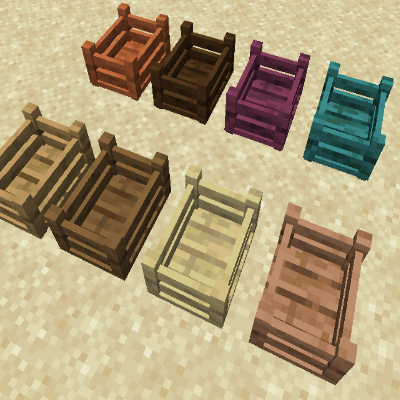
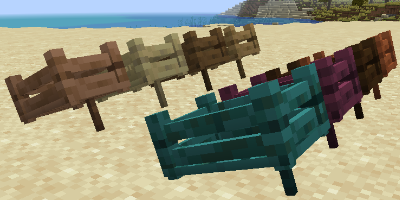

# Market Crates

  
A long time ago... in version 1.2.5 (I think) I started this mod. Lost motivation and interest but now finally found the will to finish it.
## Market Crates!!
Yes you heard it! Some crates to spice up your towns, markets, fishing docs, you name it!
- Available in all different wood types
- Shows their inventory contents
- You can stack them
- You can put a stick under it to give the crate in incline

Shift click the crate to place stack crates in the same block space.  
Hit the crate with a stick to incline the crate. Hit it once with an axe to retrieve the stick (For creative mode right clicking with a stick toggles it)

  
*Replace with proper wood types to craft the different crates*

***
  
  
  
  